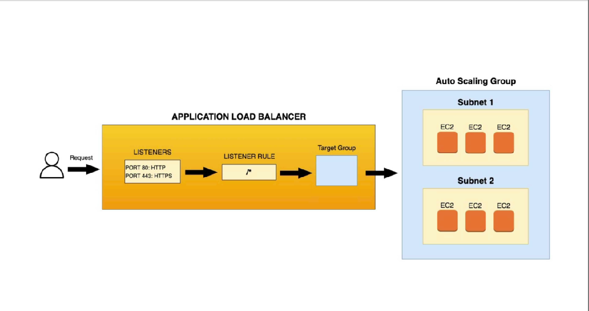

# My Terraform Project

This project deploys a simple web application to AWS using Terraform.

## Directory Structure

- `main.tf`: Terraform configuration for deploying the web application.
- `variables.tf`: Terraform variables for configuring the deployment.
- `outputs.tf`: Terraform outputs for displaying information about the deployment.

## Setup

To set up the project, you'll need to have Terraform installed on your machine. You'll also need to have an AWS account and have your AWS credentials set up.

1. Clone the repository to your local machine.
2. Run `terraform init` to initialize the project.
3. Run `terraform apply` to deploy the web application.

## Configuration

The project can be configured using the following environment variables:

- `AWS_ACCESS_KEY_ID`: Your AWS access key ID.
- `AWS_SECRET_ACCESS_KEY`: Your AWS secret access key.
- `AWS_REGION`: The AWS region to deploy to.

## Dependencies

The project relies on the following external services:

- AWS S3: Used to store static assets for the web application.

To set up these services, follow the instructions in the AWS documentation.

## Usage

To use the project, simply run `terraform apply` to deploy the web application. Once the deployment is complete, you can access the web application by visiting the URL output by Terraform.

## Testing

The project includes a simple test suite that can be run using `terraform plan`. The tests cover basic functionality of the web application.

## Contributing

To contribute to the project, please follow these guidelines:

1. Fork the repository.
2. Create a new branch for your changes.
3. Make your changes and commit them.
4. Submit a pull request.

## License

This project is licensed under the MIT License. See `LICENSE` for more information.